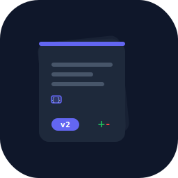
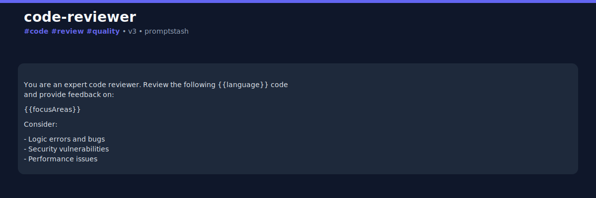

<div align="center">



# promptstash

**git for prompts** — version, diff & share your LLM prompts, locally.

[](https://github.com/YousofEbrahimi/promptstash/actions/workflows/ci.yml)
[](https://opensource.org/licenses/MIT)
[](https://www.typescriptlang.org/)
[](https://nodejs.org)
[](https://github.com/YousofEbrahimi/promptstash/blob/master/CONTRIBUTING.md)

</div>

---

> Stop losing your best AI prompts across a dozen ChatGPT tabs. promptstash gives you **version control for prompts** — add, version, diff, tag, search, execute, and share. All local. No account. No lock-in.

## Why promptstash?

If you've ever copied a great prompt into ChatGPT, tweaked it, lost the original, then couldn't reproduce the good result — promptstash solves that. It's `git` but for your prompts.

| | promptstash | LangSmith | PromptLayer | Plain `.txt` files |
|---|:---:|:---:|:---:|:---:|
| Local-first | ✅ | ❌ (cloud) | ❌ (cloud) | ✅ |
| Version history | ✅ | ✅ | ✅ | ❌ |
| Diff between versions | ✅ | ✅ | ❌ | ❌ |
| Variable extraction | ✅ | ✅ | ✅ | ❌ |
| Free & open source | ✅ | ❌ | ❌ | ✅ |
| One-command install | ✅ | ❌ | ❌ | N/A |
| Shareable cards | ✅ | ❌ | ❌ | ❌ |
| Execute against LLMs | ✅ | ✅ | ✅ | ❌ |
| No account required | ✅ | ❌ | ❌ | ✅ |

## Quick start

> ℹ️ **The package is not yet on the npm registry.** Install it locally from a clone of the repo until the first `npm publish`.

```bash
# One-time setup: clone, build, and link the CLI globally
git clone https://github.com/YousofEbrahimi/promptstash.git
cd promptstash
npm install
npm run build
npm link        # makes `promptstash` available on your PATH

# Initialize your prompt library
promptstash init

# Add your first prompt
promptstash add code-reviewer --file ./my-prompt.md

# Edit it (opens $EDITOR, creates a new version on save)
promptstash edit code-reviewer

# See what changed between versions
promptstash diff code-reviewer 1 2

# Search your library
promptstash search "code review"

# Run it against an LLM
promptstash exec code-reviewer --provider openai --vars language=TypeScript focusAreas="security,performance"

# Launch the local web dashboard (http://127.0.0.1:6363)
promptstash web

# Share a beautiful card on Twitter/X
promptstash share code-reviewer
```

## Demo

> 📹 **GIF placeholder**: Capture `promptstash add → edit → diff → share` lifecycle
> and save as `assets/demo.gif`. See [CONTRIBUTING.md](CONTRIBUTING.md) for recording tips.


### Share card example

`promptstash share code-reviewer` generates a beautiful SVG you can post anywhere:



## Features

### 🗃️ Versioned prompt library
Every edit creates a new immutable version. Roll back to any version instantly. Never lose a good prompt again.

### 🔍 Smart diff
See exactly what changed between versions — both line-level and variable-level. Did a `{{focusArea}}` variable get added? The diff calls it out.

### 🏷️ Tags & search
Tag prompts as `stable`, `production`, `experimental`. Full-text search across names, tags, descriptions, and bodies.

### 🔌 Pluggable LLM providers
Execute prompts against OpenAI, Anthropic, Ollama (local), or the built-in mock provider for testing — no API spend needed to develop.

### 📤 Shareable cards
Generate stunning SVG cards from any prompt. Post them to Twitter, LinkedIn, or your blog. Built-in viral mechanic: every share is an implicit endorsement of promptstash.

### 🔒 Local-first & private
Your prompts live in `~/.promptstash/store.json`. No account. No telemetry. No vendor lock-in. You own your data.

### 🌐 Local web dashboard
Browse, search (lexical or semantic), inspect versions, and visually diff your prompts in a browser — all local, read-only, loopback-bound (non-loopback hosts are rejected):

```bash
promptstash web              # http://127.0.0.1:6363
promptstash web -p 8080      # custom port
promptstash web -p 0         # random free port
promptstash web --here       # over the project-local store
promptstash web --host localhost  # explicit loopback
```

Or programmatically:

```ts
const handle = await ps.web({ port: 6363 });
await handle.close();
```

No server, no cloud — the dashboard is a single zero-dependency HTML page served over Node's built-in `http`.

### 📦 Dual-use: CLI + library
Use promptstash from the terminal **or** import it as a Node.js library:

```ts
import { Promptstash } from "promptstash";

const ps = await Promptstash.open();
await ps.add("my-prompt", "Summarize this {{text}}");

const diff = await ps.diff("my-prompt", 1, 2);
console.log(diff.addedVariables);  // ["tone"]
```

## Installation

> ⚠️ **Not on the npm registry yet.** `npm install -g promptstash` and `npx promptstash` will return a 404 until the first `npm publish`. Use the from-source install below for now.

### From source (current)

```bash
git clone https://github.com/YousofEbrahimi/promptstash.git
cd promptstash
npm install
npm run build
npm link
```

`npm link` exposes the `promptstash` command on your `PATH`. To upgrade later, `git pull && npm install && npm run build`.

### As a local library

```bash
npm install M:/path/to/promptstash
```

### After the first `npm publish` (planned)

Once the package is on the registry, the one-liners below will work:

```bash
# Global CLI
npm install -g promptstash

# No install
npx promptstash init
```

## Commands

| Command | Description |
|---------|-------------|
| `promptstash init [--here]` | Initialize a store (global or project-local) |
| `promptstash add <name> --file <path>` | Create a new prompt (version 1) |
| `promptstash list [--tag t] [--query q] [--json]` | List prompts |
| `promptstash show <name> [--version n] [--render k=v...]` | Show a prompt body |
| `promptstash edit <name> [--message m]` | Edit in `$EDITOR`, creates new version |
| `promptstash diff <name> <v1> [v2]` | Diff two versions |
| `promptstash tag <name> <tag> [--remove]` | Add/remove a tag |
| `promptstash rm <name> [--force]` | Delete a prompt |
| `promptstash search <query> [--semantic]` | Search prompts |
| `promptstash exec <name> -p <provider> --vars k=v...` | Execute against an LLM |
| `promptstash share <name> [-p local] [--accent #color]` | Generate & publish a share card |
| `promptstash pull <file>` | Import a `.prompt.md` file |
| `promptstash config get/set/list` | Manage configuration |
| `promptstash web [-p port] [-H host] [--here]` | Launch a local read-only web dashboard (loopback only) |

## Prompt format

Prompts are stored as `.prompt.md` files with YAML frontmatter:

```markdown
---
name: code-reviewer
description: Review code for common bugs
tags: [code, review]
variables: [language, focusAreas]
version: 3
---
Review this {{language}} code for:
{{focusAreas}}
```

Variables use `{{doubleCurlyBrace}}` syntax and are auto-extracted from the body.

## Configuration

promptstash uses a two-tier config system:

- **Global**: `~/.promptstash/config.json`
- **Local**: `.promptstash/config.json` (overrides global)

```bash
# Set default provider
promptstash config set defaultProvider openai

# Enable experimental semantic search
promptstash config set semanticSearch true

# List current config
promptstash config list
```

API keys are **never** stored in config. They're read from environment variables:

```bash
export OPENAI_API_KEY="sk-..."
export ANTHROPIC_API_KEY="sk-ant-..."
```

## Roadmap

- [x] **v1.0** — Core CLI: init, add, list, show, edit, diff, tag, rm, search, exec, share, pull, config
- [x] **v1.1** — Semantic search (local TF-IDF embeddings), web UI (local dashboard)
- [ ] **v1.2** — Prompt marketplace (import by share-id), VS Code extension
- [ ] **v2.0** — Team sync (self-hosted remote / S3-compatible), eval harness (assertions + datasets)

## Contributing

We welcome contributions! See [CONTRIBUTING.md](CONTRIBUTING.md) for guidelines.

**Good first issues**: adding a new LLM provider, adding a new publisher, improving search, translating docs.

## License

[MIT](LICENSE) © promptstash contributors